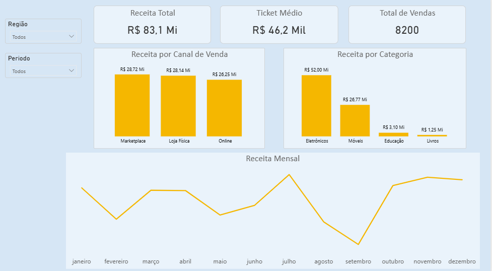
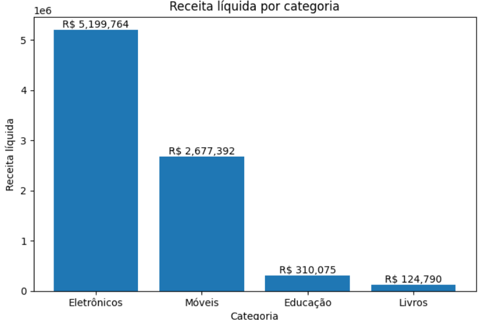

# 📊 Análise de Vendas – Python & Power BI

##  Objetivo:
Projeto de análise de vendas com foco em insights de negócio, utilizando Python para análise exploratória dos dados e Power BI para visualização interativa.

##  Perguntas de Negócio Respondidas:
- Quais categorias geram maior receita líquida?
- Qual a relação entre volume vendido e receita?
- Quais categorias possuem alto volume, mas baixa receita?
- Como as vendas se distribuem ao longo do tempo?

##  Tecnologias Utilizadas:
- Python (Pandas, Matplotlib)
- Power BI
- Jupyter Notebook
- Git & GitHub

##  Análises Realizadas:
- Análise de receita por categoria
- Análise de volume de vendas
- Visualizações com gráficos de barras e dispersão
- Dashboard interativo no Power BI

##  Dashboard:
O dashboard foi desenvolvido no Power BI com foco em análise executiva de vendas.

##  Estrutura do Projeto:
- ´analise-vendas-python.ipynb`: Notebook com análise exploratória utilizando Python e pandas.
- ´dashboard-vendas-powerbi.pbix`: Arquivo do Power BI com visualizações interativas.
- ´dataset_vendas.csv`: Dataset utilizado para as análises.
- ´images/`: Imagens de apoio para visualização do projeto.

 ## Visualizações:

### Dashboard de Vendas – Power BI

### Receita por Canal de Venda – Python

## Conclusões

- O canal de venda com maior volume não é necessariamente o que gera maior receita.
- Diferenças de performance entre canais indicam oportunidades de estratégia comercial.
- O uso combinado de Python e Power BI permite análises profundas e comunicação clara dos resultados.
